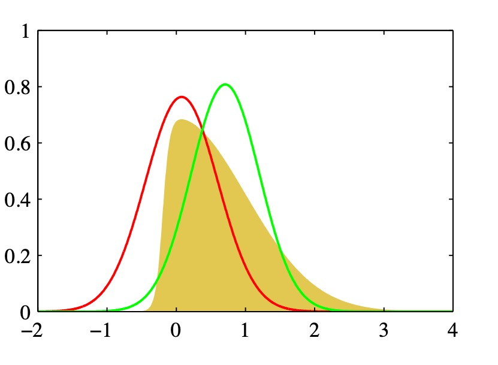
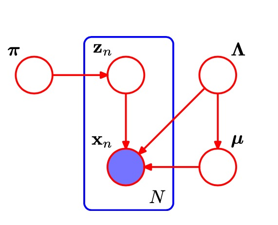

# 10 近似方法
概率模型中的一个中心任务是给定观测变量$X$求潜在变量$Z$的后验概率分布$P(Z|X)$以及计算这个概率分布的期望。在完全贝叶斯分析中，求和或者积分掉所有中间变量会因为维度太高，计算量过大而无法完成。这时候只能退而求其次采用近似方法。近似方法主要有两类：1. 随机近似比如马尔科夫链，蒙特卡洛方法。2.本章将讨论的确定近似方法 **变分推断(variational inference)** 或者 **变分贝叶斯(variational Bayes)** 。

## 10.1 变分推论
函数：给定变量返回一个数。
泛函：给定函数返回一个数，比如计算熵给定一个分布函数返回其熵值。泛函微分为泛函对输入函数微小变化的反应。
变分法：用来寻找可以使得泛函达到极大或者极小值的一种方法。
虽然变分方法本质上没有任何近似的东西，但是它们通常会被用于寻找近似解。寻找近似解的过程可以这样完成:限制需要最优化算法搜索的函数的范围，例如只考虑二次函数，或者考虑由固定的基函数线性组合而成的函数，其中只有线性组合的系数可以发生变化。考虑问题变量为$X$，隐变量为$Z$。模型确定了联合概率分布$p(Z,X)$目标是找到后验概率$p(Z|X)$和$p(X)$的近似。
$$\ln p(X) = L(q) + KL(q||p)$$
$$L(q) = \int q(X) \ln \{\frac {p(X,Z)}{q(Z)}\}$$
$$KL(q||p) = - \int q(X) \ln \{\frac {p(Z|X)}{q(Z)}\}$$
与EM方法对比，$\theta$被整合进隐变量$Z$中。这里要求$q(Z)$使得$L(q)$最大此时也有$KL(q||p)$最小，理论上此时$q(Z) = p(Z|X)$但是通常这都是不可解的。所以我们限制$q(Z)$的形式，方便计算求解，注意$q(Z)$是不会有过拟合现象的。一个限制$q(Z)$的方法是使用参数形式，$q(Z|w)$然后用标准最优化方式求$w$的值。

红色为拉普拉斯近似，绿色为使用高斯分布变分近似。

### 10.1.1 分布的分解
考虑一种限制$q(Z)$的方法，我们假定它可以分解为若干互不相干的组。
$$q(Z) = \prod_{i=1}^M q_i(Z_i)$$
变分推断的这个分解的形式对应于物理学中的一个近似框架，叫做平均场理论。 在这个近似下有:
$$L(q) = \int \prod_i q_i \{ \ln p(X,Z) - \sum_i \ln q_i \}$$
$$L(q) = \int q_j \ln \hat p (X, Z_j) dZ_j - \int q_i \ln q_i dZ_j + const$$
其中
$$\ln \hat{p}(X, Z_j) = E_{i\neq j} [ \ln p (X, Z)] + const$$
号$E_{i \neq j}[]$表示关于定义在所有$z_i(i\neq j)$上的$q$概率分布的期望
$$E_{i \neq j} [\ln p(X, Z)] = \int \ln p(X,Z) \prod_{i\neq j} q_i dZ_i$$
因为L的公式是一个KL散度公式，最小化 L 可以得到:

$$\ln q_j^*(Z_j) = E_{i\neq j} [ \ln p (X, Z)] + const $$

然而，这些方程并没有给出一个显式的解，因为最优化$q_j^*(Z_j)$的公式的表达式依赖于关于其他的因子$q_i(Z_j)(i\neq j)$计算的期望。所以需要用下面的方式寻找出一个相容的解:首先，恰当地初始化所有的因子$q_i(Z_i)$然后 在各个因子上进行循环，每一轮用一个修正后的估计来替换当前因子，计算时使用了当前对于所有其他因子的估计。算法保证收敛，因为下界关于每个因子$q_i(Z_i)$是一个凸函数。

### 10.1.2 分解近似的属性
将分布分解用于高斯分布的分解，考虑两个变量$Z = (z_1, z_2)$ 上的高斯分布$p(Z) = N (Z|\mu, A^{-1})$通过近似可以求得：
$$\ln q^*_1(z_1) = - \frac 1 2 z_1^2 A_{11} + z_1 \mu_1A_{11} - z_1A_{12} E[z_2] -\mu_2 + const$$

所以有:
$$q^*_1(z_1) = N(z_1|m_1, A_{11}^2)$$
$$q^*_2(z_2) = N(z_2|m_2, A_{22}^2)$$
其中:
$$m_1 = \mu_1 - A_{11}^{-1}A_{12}(E[z_2] -\mu_2)$$
$$m_2 = \mu_2 - A_{22}^{-1}A_{21}(E[z_1] -\mu_1)$$
一般求解需要连续迭代，但是这里可以直接看出$m_1 = \mu_1;m_2 = \mu_2$为方程的解。此时，均值被正确地描述了，但是$q(z)$的方差由$p(z)$的最小方差的方向所确定，沿着垂直方向的方差被强烈地低估了。这是一个一般的结果，即分解变分近似对后验概率分布的近似倾向于过于紧凑。而如果我们最小化相反的KL散度$KL(p||q)$，这个过程叫的过程叫**期望传播（expectation propagation）**。 
$$q_j^* = p(Z_j)$$

将此过程用于高斯混合分布。用一个高斯模型去模拟多个高斯混合模型。使用变分法近似KL会导致单个高斯模型收缩到多个高斯混合分布中的一个上。而如果直接最小化KL则会收缩于一个多高斯的综合模型。

### 10.1.3 一元高斯分布
给定观测数据集$X = {x_1, x_2, x_3, ... x_n}$推测均值$\mu$和精度$\tau$。数据集从高斯分布生成。似然函数为：
$$p(D | \mu, \tau) = (\frac \tau {2\pi})^2 exp \big \{ -\frac \tau 2 \sum_n (x_n - \mu)^2 \big \}$$
两个参数有先验概率：
$$p(\mu | \tau) = N(\mu | \mu_0, (\lambda_0\tau)^-1)$$
$$p(\tau) = Gam(\tau | a_0, b_0)$$
这些分布共同给出一个共轭高斯分布。此情况下后验概率可以直接解出，不过这里采用变分近似的方法假设：
$$q(\mu, \tau) = q_\mu(\mu)q_\tau(\tau)$$
通过求解可以得到$q_\mu$是一个高斯分布，其中
$$\mu_N=\frac{\lambda_0\mu_0 + N \hat x}{\lambda_0 + N}$$
$$\tau_N=(\lambda_0+N)E(\tau)$$
N趋于无穷时，精度无穷大，而$\mu_N = \hat x$，$\tau_N$分布是一个Gamma分布
$$a_N = a_0 + \frac {N+1} 2$$
$$b_N = b_0 + \frac 1 2 E_\mu[\sum_{n=1}^N(x_n-\mu)^2 + \lambda_0(\mu - \mu_0)^2]$$

### 10.1.4 模型比较
除了在隐含变量$Z$上进行推断之外，变分还可以对比一组候选模型。

## 10.2 例子:高斯的变分混合
高斯混合模型对于每个$x_n$有个1-of-k的潜变量$z_n$，给定混合系数$z_n$的分布为:
$$p(Z|\pi) = \prod_n\prod_k\pi_k^{z_{nk}}$$
而此时观测数据的条件概率分布为:
$$p(X|Z,\mu,A) =\prod_n\prod_k N(x_n|\mu_k, A_k^{-1})^{z_{nk}}$$
对其中的参数$\tau,A,\mu$引入共轭先验概率：
$$p(\pi) = Dir(\pi|\alpha_0) = C(\alpha_0)\prod_{k=1}^K\pi_k^{\alpha_0 -1}$$
$$p(\mu,A) = \prod_k N (\mu_k | m_0, (\beta_0A_k)^{-1})W(A_k |W_0,v_0)$$
其概率图为：

潜在变量一般随着数据集变大而变大，参数则不会变化。所以潜在变量一般待在框内部

### 10.2.1 变分分布
考虑一个变分分布
$$q(Z,\pi,\mu,A) = q(Z) q(\pi,\mu,A)$$
其中$q(Z)$与$q(\pi,\mu,A)$的函数形式会在计算过程中自动确定。可以得到：
$$\ln q^*(Z) = \sum_{n=1}^N\sum_{k=1}^K z_{nk} \ln \rho_{nk} + const$$
$$\rho_{nk} = E[\ln \pi_k] + \frac 1 2 E[\ln |A_k|] - \frac D 2 \ln (2 \pi) - \frac 1 2 E_{\mu_k,A_k}[(x_n - \mu_k)^TA_k(x_n -\mu_k)]$$
$$r_{nk} = \frac {\rho_{nk}} {\sum_j \rho_{nk}}$$
$$E[z_{nk}] = r_{nk}$$
而对$q(\pi,\mu,A)$也可以通过变分计算出其，形式，分别与假设相同。为Dir和高斯wishart分布。高斯分布的贝叶斯混合的变分解与最大似然的EM算法的解很相似。事实上，如果我们考虑$N \rightarrow \infty$的极限情况，那么贝叶斯方法就收敛于最大似然方法的EM解。

### 10.2.2 变分下界
我们可以进一步地使用变分下界检查更新方程的数学推导和它们的软件执行的正确性，方法是使用有限差来检查每次更新确实给出了下界的一个(具有限制条件的)极大值。

### 10.2.3 预测概率密度
在高斯模型的贝叶斯混合的应用中，我们通常对观测变量的新值的预测概率密度感兴趣。
$$p(\hat x| X) = \sum_z \int\int\int p(\hat x | \hat z, \mu ,\Lambda) p(\hat z| \pi ) p(\pi, \mu, \Lambda |X)d\pi d\mu d\Lambda$$
使用$q(\pi) q(\mu,\Lambda)$变分近似替代$p(\pi, \mu, \Lambda|X)$
最后可以得到一个t分布。

### 10.2.4 确定分量的数量
如果我们有一个由K个分量组成的混合模型，那么每个参数设置都是K!个等价设置中的一个。由于等价的峰值具有等价的预测分布，因此只要我们考虑一个具有具体的数量K个分量组成的模型，那么这种等价性就无需担心。然而，如果我们项比较不同的K值，那么我们需要考虑这种多峰性。一个简单的近似解法是当我们进行模型比较和平均时，在下界中增加一项$\ln K!$。

### 10.2.5 诱导分解
`略`
