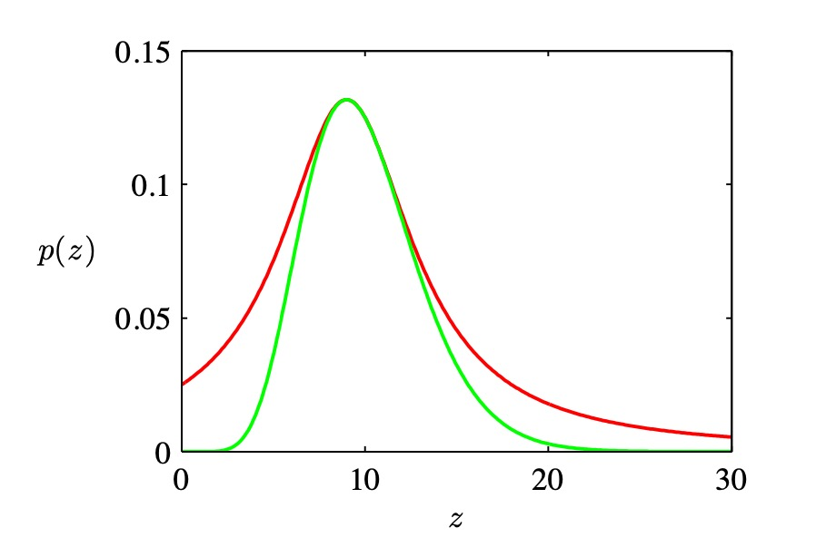
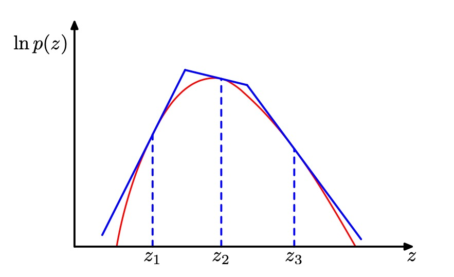

# 第十一章 采样方法
大多数概率模型解析解都很难求得，所以需要近似，第十章为确定近似，主要方法为贝叶斯变分法和期望传播。本章的推论方法为数值近似，或者叫蒙特卡洛技术。虽然很多时候我们的都对计算后验概率感兴趣，但是实际上很多时候我们的最终目标实际上是根据后验概率计算某个函数的期望比如预测一个新数据点。此时我们的问题为计算$p(z)$概率下$f(z$)函数的期望。
$$E[f] = \int f(z) p(z) dz $$
此时，我们的主要目标是根据$p(z)$概率进行采样出一组独立变量$z_l,l=1,2,3...L$，计算f值最后取平均。

$$\hat f = \frac 1 L \sum_{l=1} ^ L f( z ^{(l)}))$$

这样采样得到的期望等于原函数期望。 这样得到期望的精度和$z$的维度无关。一般来说使用10-20个采样就可以得到相对较高的精度了。不过采样经常不满足$IDD$条件，这样使得有效样本量比看起来的要小。还有如果$f(z)$在$p(z)$很小的地方有很大的值，则可能要增加采样数量提高精度。

对于没有观测变量的图中，先祖采样是可行的，联合概率分布为：
$$p(z) = \prod_i p(z_i| pa_i)$$
考虑某些结点被观测值进行初始化的有向图的情形。对上述步骤的推广给出了 **逻辑采样(logic sampling)** 的方法，它可以被看做11.1.4节讨论的 **重要采样(importance sampling)** 的一种特殊情况。在每一个步骤中，当我们得到了变量zi的一个采样值，它的值被观 测，并且将采样值与观测值进行比较然后看是否观测值是否符合，不符合的丢弃。这个方法的缺点是效率太低。而对于无向图则不存在类似的单向采样方法，必须采样更加计算复杂型的方法，比如吉布斯采样。如果要求边缘概率的采样，则简单进行条件概率采样然后忽视边缘项即可。

## 11.1 基本采样算法
本节研究从一个给定分布中生成随机样本的简单方法，计算机默认可以生成$(0, 1)$之间的伪随机数。
### 11.1.1 标准分布
需要将$(0,1)$之间伪随机数$z$根据某种分布映射到变量y上面去。映射为$y = f(z)$，而y的取值又要符合概率分布$p(y)$。有
$$p(y) = p(z)|\frac {dz}{dy}|$$
其中，$p(z)$为1，所以可以得到
$$z= h(y) = \int_{- \inf}^y p(\hat y ) d \hat y$$
而变换取$y = h^{-1}(z)$ 即可。对于多个变量情形的推广是很容易的，涉及到变量变化的Jacobian行列式
$$p(y_1,y_2,y_3,..y_M) = p(z_1,z_2,...z_M) |\frac{\partial(z_1,z_2,...z_m)}{\partial(y_1,y_2,...y_m)}|$$

**Box-Muller**方法：先进行正方形采样，然后去掉圆外的点得到圆形采样。再做变换得到高斯采样。总结这种转换方法通过反转不定积分获得所需分布。但是只适合少数简单分布情况。这里引入两种技术：**rejection sampling（拒绝采样）** 和 **importance sampling（重要采样）**虽然他们只适合单变量情况，但是确实更普适方法的重要组成部分。

### 11.1.2 拒绝采样

前提：函数很复杂没法用标准采样，我们知道任意位置的p(z)。

$$p(z) =  \frac 1 {Z_p} \hat p (z)$$

其中$\hat p(z)$已知但是$Z_p$不知道。为了应用拒绝采样方法，我们需要一些简单的概率分布$q(z)$，有时被称为 **提议分布(proposal distribution)** ，并且我们已经可以从提议分布中进行采样。接下来，我们引入一个常数$k$，它的值的选择满足下面的性质:对所有的$z$值，都有$kq(z) ≥ p (z)$。先按照$q(z)$采样，然后如果$kq(z) > \hat p(z)$ 则抛弃这个点，否则留下。可以计算出

$$p(sample) = \int \frac{\hat p(z) }{kq(z)}q(z)dz$$ 
$$ = \frac 1 k \int \hat p(z) dz$$

### 11.1.3 自适应拒绝采样
在许多我们希望应用拒绝采样的情形中，确定概率分布$q(z)$的一个合适的解析形式是很困难的。另一种确定其函数形式的方法是基于概率分布$p(z)$的值直接构建函数形式。界限函数本身由一个分段分布组成

拒绝采样受维度灾变影响很大，一个维度损失1%，1000个维度则可能只有1/20000的采样可以被接受,所以无法运用在高维情况。

### 11.1.4 重要采样
采样的一个很重要的作用是计算公式11.1中的期望。重要采样可以直接计算期望，而不需要按照$p(z)$进行采样。如果我们无法直接从$p(z)$采样但是可以很容易计算p(z)则我们可以网格化$p(z)$计算每一个网格中的$p(z^l)f(z^l)$。但是这样随着维度增加效率低下。

与拒绝采样的情形相同，重要采样基于的是对提议分布$q(z)$的使用，我们很容易从提议分布中采样，然后有

$$E[f] = \frac {Z_q}{Z_p} \int f(z) \hat r_l q(z) dz$$

其中$r_l = \frac{p(z^l)}{q(z^l)}$为重要权重。而$\frac {Z_q}{Z_p}$可以通过采样计算得到
$$\frac {Z_q}{Z_p} = \frac 1 L \sum_{l=1}^L \hat r_l$$
经常出现的情形是$p(z)$变化剧烈，并且大部分的质量集中于z空间的一个相对较小的区域中，此时重要性权重${r_l}$由几个具有较大值的权值控制，剩余的权值相对较小。因此，有效的样本集大小会比表面上的样本集大小L小得多。因此，重要性采样方法的一个主要的缺点是它具有产生任意错误的结果的可能性，并且这种错误无法检测。

### 11.1.5 采样-重要-重采样
拒绝采样需要确定k值，这个值通常难以确定，过大的k值会降低采样效率。本节的方法类似拒绝采样但不用确定k值。本方法两个阶段，在第一个阶段，$L$个样本$z_1,...,z_L$从$q(z)$中抽取。然后在第二个阶段，权值$w_1,...,w_L$通过类似重要性采样的方法被构建出来。最后，L个样本的第二个集合从离散概率分布$z_1, . . . , z_L$中抽取，概率由权值$w_1,...,w_L$给定。

### 11.1.6 采样和EM算法
采样可以用来求EM算法中E步骤。特别是当E步骤没有解析解时。可以将其中的期望改为采样。 在M步骤中关于θ最大化的步骤为完整数据对数似然的期望，形式为

$$Q(\theta, \theta^{old}) = \int p(Z|X,\theta^{old}) \ln p (Z ^{(l)}, X | \theta)dZ$$

这样可以将M步骤需要计算的最大值简化为

$$Q(\theta, \theta^{old}) = \frac 1 L \sum_{l=1}^L \ln p (Z ^{(l)}, X | \theta)$$

这个方法叫蒙特卡洛EM算法。其特例为随机EM，每次E步骤更新一个采样。其完整贝叶斯处理，引入先验概率，这时候就是IP算法。

## 11.2 马尔科夫链蒙特卡洛
拒绝采样和重要采样方法在高维空间无法使用，我们在本节中讨论一个非常一般的并且强大的框架，被称为 **马尔科夫链蒙特卡罗(Markov chain Monte Carlo, MCMC)** ，它使得我们可以从一大类概率分布中进行采样，并且可以很好地应对样本空间维度的增长。

与拒绝采样和重要采样相同，我们再一次从提议分布中采样。但是这次我们记录下当前状$z^\tau$以及依赖于这个当前状态的提议分布$q(z|z^\tau)$样本序列构成了一个马尔可夫链。与之前一样，如果我们有$p(z)= \frac {\hat p (z)}{Z_p}$，那么我们会假定对于任意的$z$值都可以计算$\hat p(z)$，虽然$Z_p$的值可能未知。在算法的每次迭代中，我们从提议分布中生成一个候选样本$z$ ，然后根据一个恰当的准则接受这个样本。 

比如Metropolis-Hastings算法中，样本被接受的概率为:
$$A(z^*, z^\tau) = min (1, \frac {\hat p(z^*)}{\hat p(z^\tau)})$$
如果候选样本被接受，则$z^{(\tau + 1)} = z^*$，否则候选样本$z^*$。$z^{(\tau + 1)} = z^{(\tau)}$ 这与拒绝采样不同，那里拒绝的样本被简单地丢弃。在Metropolis算法中，当一个候选点被拒绝时，前一个样本点会被包含到最终的样本的列表中，从而产生了样本点的多个副本。

然而，应该强调的是，序列$z(1), z(2), . . .$不是来自$p(z)$的一组独立的样本，因为连续的样本是高度相关的。如果我们希望得到独立的样本，那么我们可以丢弃序列中的大部分样本，每$M$个样本中保留一个样本。对于充分大的$M$，保留的样本点对于所有的实际用途来说都是独立的。

### 11.2.1 马尔科夫链
马尔可夫链是：

$$p(z^{(m+1)} | z^{(1)}, z^{(2)}...z^{(m)}) = p(z^{(m+1)} | z^{(m)})$$

转移概率为$T_m(z^{m}, z^{m+1}) = p(z^{(m+1)}|z^{(m)}$ 如果马尔科夫链的转移概率不随m变化，则成为homogeneous(同质)的。

对于一个特定的变量边缘概率为：
$$p(z^{(m+1)}) = \sum_{z^{(m)}}p(z^{(m+1)}|z^{(m)})p(z^{(m)})$$
如果一个概率分布在马尔可夫链中每一步都保持不变，则这个分布关于该马尔可夫链是不变的。即:
$$p^*(z) = \sum_{z'}T(z',z)p^*(z')$$
确保概率分布不变的一个充分条件为满足细节平衡条件(detailed balance)
$$p^*(z)T(z,z') = p^*(z')T(z',z)$$
此时马尔可夫链是可翻转的。

我们的目标是使用马尔科夫链从一个给定的概率分布中采样。这个马尔可夫链的概率分布是不变的，而且对于$m -> \infty$ 有$p^{(m)}$收敛与所求不变概率分布。

### 11.2.2 Metropolis-Hastings algorithm
我们现在可以证明$p(z)$对于由 **Metropolis-Hastings算法** 定义的马尔科夫链是一个不变的概率分布。

## 11.3 吉布斯采样
是一种广泛使用的MCMC算法也是上一章中的MH算法的一个特例。在吉布斯采用中我们一次替换分布中变量。虑我们想采样的概率分布$p(z)=p(z_1,...,z_M)$，并且假设我们已经选择了马尔科夫链的某个初始的状态。吉布斯采样的每个步骤涉及到将一个变量的值替换为以剩余变量的值为条件，从这个概率分布中抽取的那个变量的值。因此我们将$z_i$替换为从概率分布$p(z_i|Z_{except(i)})$中抽取的 值，其中$z_i$表示$z$的第$i$个元素，$z_{except(i)}$表示$z_1,...,z_M$去掉$z_i$这一项。这个步骤要么按照某种特定的顺序在变量之间进行循环，要么每一步中按照某个概率分布随机地选择一个变量进行更新。

1. Initialation{z, i=1,...,M}
2. for t = 1, ... T:
    $$z_1^{t+1} ~ p(z_1|z_2^t,z_3^t,...z_M^t)$$
    $$z_2^{t+1} ~ p(z_2|z_1^{t+1},z_3^t,...z_M^t)$$
    $$...$$
    $$z_M^{t+1} ~ p(z_M|z_1^{t+1},z_2^{t+1},...z_{M-1}^{t+1})$$

## 11.4 切片采样
基于随机游走的`Metropolis`算法有个大问题在于对步长敏感，如果步长太长则拒绝率太高，如果步长太低则游走到边缘需要的步数很高。切片采样可以提供自适应步长，自动匹配当前分布。不过它也需要我们可以计算未归一化的分布$\hatp(z)$

首先考虑一元变量的情形。切片采样涉及到使用额外的变量$u$对$z$进行增广，然后从联合的$(z, u)$空间中采样。目标是从
$$\hat p(z,u) = \frac 1 {Z_p};0 < u < \hat p(z)$$
$$ = 0;other condition$$
其中$Z_p = \int\hat p (z) dz$

## 11.5 混合蒙特卡洛算法
正如我们已经注意到的那样，Metropolis算法的一个主要的局限是它具有随机游走的行为，而在状态空间中遍历的距离与步骤数量只是平方根的关系。仅仅通过增大步长的方式是无法解决这个问题的，因为这会使得拒绝率变高。
`略`
### 11.5.1 动态系统

### 11.5.2 混合蒙特卡洛方法

## 11.6 估计划分函数
那么为了从$p(z)$中采样，归一化常数$Z_E$的值(也被称为划分函数)是不需要的。然而，关于$Z_E$的信息对于贝叶斯模型比较是有用的，因为它表示模型证据(即观测数据能够生成模型的概率)，因此我们对它的值如何得到很感兴趣。
对于模型比较来说，我们所需的实际是两个模型的划分函数的比值。将这个比值与先验概率的比值相乘可以得到后验概率的比值。之后可以用这个比值来进行模型选择或者模型平均。
一种估计划分函数比值的方法是使用概率分布的重要采样，这个概率分布的能量函数为$G(z)$，另一种方法是使用从马尔科夫链中得到的样本来定义重要采样分布。