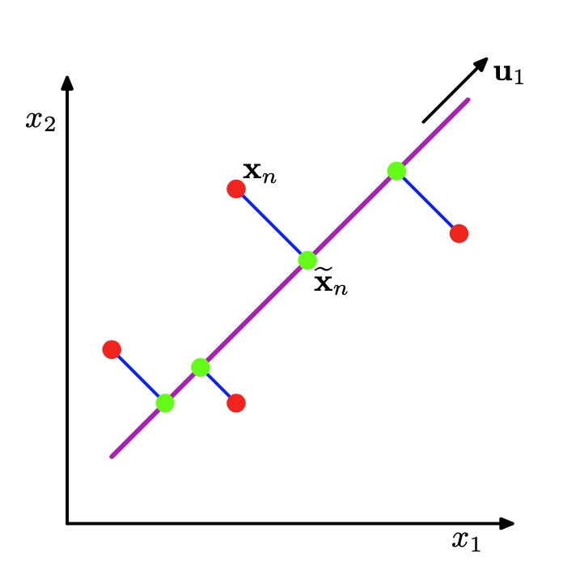
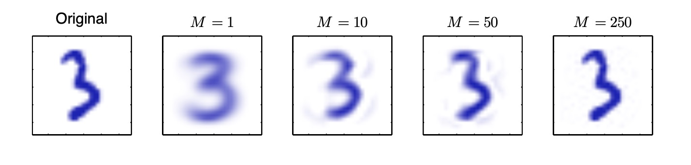
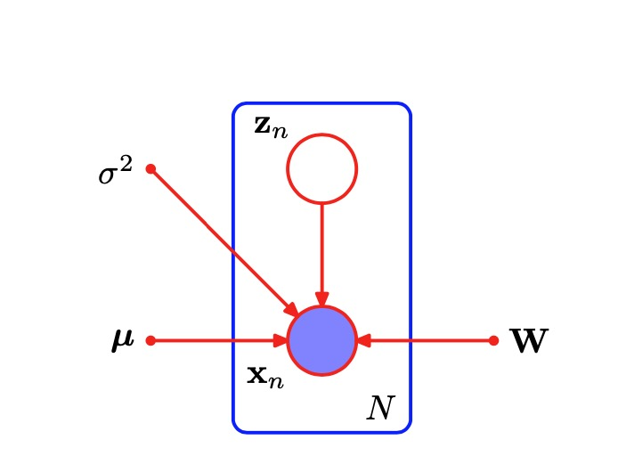

# 第十二章 12 连续潜在变量

本章主要介绍连续变隐变量的概率模型。本章的一个重要动机是很多模型中的数据都存在于一个低位的子空间中。我们可以从生成式考虑该模型，首先依据隐变量在流行上生成一个数据点，然后将观测噪声加到上面变成一个观测点。最简单的连续隐变量模型，假设观测变量和噪音都是线性高斯，这种方法就是 PCA。

## 12.1 主成分分析(Principal Component Analysis)
这是一种广泛采用的降维，有损压缩，特征提取，特征可视化方法。有两种常用定义都能得到相同的 PCA 算法。

> 主成分分析寻找一个低维空间，被称为主子平面，用紫色的线表示，使得数据点(红点)在子空间上的正交投影能够最大化投影点(绿点)的方差。PCA的另一个定义基于的是投影误差的平方和的最小值，用蓝线表示。

### 12.1.1 最大方差公式
将一个D维数据集$x_n$投影到 M 维空间，使其方差最大。一维情况下，数据集的平均值为:

$$\hat{x} = \frac 1 N \sum_{n=1}^{N} x_n $$

所以方差为

$$ u^T S u $$

$$ S=\frac 1N \sum_{n=1}^N (x_n - \hat x ) (x_n - \hat x ) ^ T$$

加上约束利用拉格朗日乘子可以推得：
> 当 u 为 S 的本征向量时方差最大，最大方差为本征值。这个本征向量又叫`第一主成分`

对于其他M-1维的向量可以依次选取和之前所有本征向量正交，且本征值最大的本征向量。算法的复杂度和本征值分解一样为 $O(D^3)$。

### 12.1.2 最小误差公式
同样是D维空间投影到M维。选取旋转后的单位正交坐标系${u_i}$，其中$i=1,2,3...D$ 数据点可以表示为：
$$x_n = \sum_{i=1}^D (x^T_n u_i)u_i $$
M维线性子空间可以用前M个基向量表示：
$$\hat x_n = \sum_{i=1}^M z_{ni} u_i + \sum_{i=M+1}^D b_i u_i $$
其中 $z_{ni}$ 为每个不同数据点不同，而 $b_i$ 为所有点共享同一数据

我们的目标是使得$J$最小
$$J = \frac 1 N \sum_{n=1}^N || x_n - \hat{x_n}||^2 $$
可以推得$J$最小时$z_{nj}$与 原始数据相同。而$b_i$等于原始数据的平均值。最后$J$和最大方差方法相似
$$J = \sum _{i=M+1}^D u_i^T S u_i$$
可以推得，J的最小值在$u_i$为`S`本征值时达到，为了让 J 更小，我们需要让`pca`子平面通过所有数据的算数平均值并且和方差最大的M个本征向量平行。

### 12.1.3 PCA的应用
1. 图像压缩。

2. 数据预处理。
3. 数据可视化。

在预处理中，PCA可以代替标准化。只要经过如下变化即可。

$$ y_n = L^{-\frac 1 2} U^T(x_n -\hat x)$$

**标准化(standardizing)**:

$$\rho_{ij} = \frac 1 N \sum_{n=1} ^ N \frac{(x_{ni} - \hat{x_i})(x_nj - \hat{x_j})}{\sigma_i \sigma_j}$$

其中$\sigma$为方差

### 12.1.4 高纬 PCA

如果数据的维度大多于数据量，则降维的维度上限为数据量减去1，否则会出现大量为0的纬度。而且因为原始空间的高纬度，导致算法复杂度过高，计算变得不可能。可以采用如下方法解决。

将N个D维空间的向量，将方差矩阵S的维度和数据点互换。使得算法复杂度从$O(D^3)$下降为$O(N^3)$。

## 12.2 概率PCA

前一节讨论的PCA的形式所基于的是将数据线性投影到比原始数据空间维度更低的子空间内。我们现在说明，PCA也可以被视为概率潜在变量模型的最大似然解。本节从概率隐变量模型的角度用最大似然表示PCA。概率PCA表示方法有好处：

- 概率PCA表示了一个参数数量收到限制但是依然能捕捉到数据集中领域关系的高斯分布中。
- 可以用EM算法只求解少数几个本征值，而避免立方复杂度的本征值分解。
- 概率模型和EM算法帮助对付缺失值。
- 混合概率PCA模型可以用EM方法训练得到。
- 概率PCA是贝叶斯PCA的基础。
- 似然方程可以帮助我们直接比较不同概率模型。
- 概率PCA可以用于有类别的密度分布，然后用于解决分类问题。
- 概率PCA可以用来生成数据。

概率PCA模型是一个线性高斯模型的特例。其条件概率，边缘概率都是高斯。

我们假设：
$$ p(z) = N(z| 0 , I)$$
其中$z$是潜在变量，为$M$维。
$$ p(x|z) = N(x|Wz + \mu, \sigma^2 I)$$
$W$为 $D \times M$ 维，$\mu$ 为 $D$ 维
可以得到$x$的边缘概率分布：

$$(x) = \int p(x|z)p(z)dz = N(x | \mu, C) $$

其中
$$ C=WW^T + \sigma ^2 I$$

可以通过$M = W^TW + \sigma^2I$求得C的逆，和条件概率
$$p(z|x)  = N(z|M^{-1}W^T(x-\mu), \sigma^2M)$$

### 12.2.1 最大似然PCA

用最大似然来决定刚才的概率PCA中的参数。
$$ \ln (X|W,\mu,\sigma^2) = - \frac {DN} 2 \ln(2\pi) - \frac N 2 \ln|C| -\frac 1 2 \sum_{n=1}^{N} (x_n -\mu)^TC^{-1}(x_n-\mu) $$
取导数为0可以得到$\mu = \hat x$，这是唯一极大值。而$W$和$\sigma^2$的极大值可以用同样方法求得。
$$W_{ML} = U_M(L_M-\sigma^2I)^{\frac 1 2}R$$
其中U为$D \times M$ 维矩阵其列为$S$矩阵本征向量的子集。而且当选取的本征向量的本征值为前M大时，其似然方程有最大值。 此时有:
$$\sigma_{ML}^2 = \frac 1 {D-M}\sum_{i=M+1}^D \lambda_i $$

R为$M \times M$任意正交变换矩阵，如果用求本征值的方法求W，则可以简单设置R为单位矩阵I。如果用EM之类的数值方法求解，则R的值不可控。当然EM方法也可以改变下，然后获得依次下降的正交主成分。

现在考虑数据点在主成分平面的映射。

$$ E[z|x] = M^{-1} W\_{ML}^T(x-\hat x)$$

其在原始空间中的点为$$W E[z|x] + \mu$$，如果取 $\sigma -> 0 $ 则可以得到对主成分平面的投影。

### 12.2.2 PCA 中的EM算法。

虽然PCA有解析解，但是使用EM算法处理依然可以获得如下好处：
1. 计算复杂度低。
2. 可以在衍生到其他没有解析解的模型。
3. 可以处理缺省值。

- E步骤:
$$E[z_n] = M^{-1}W^T(x_n - \hat x)$$
$$E[z_nz_n^T] = \sigma^2 M^{-1} + E[z_n]E[z_n]^2$$
- M步骤:
$$W_{new} = [\sum_{n=1}^N(x_n-\hat x) E[z_n]^T] [\sum_{n=1}^NE[z_nz_n^T]]^{-1}$$
$$\sigma_{new}^2 = \frac 1 {ND} \sum_{n=1} ^N ( ||x_n-\hat x|| ^ 2 - 2 * E[z_n] ^ T W_{new} ^ T (x_n - \hat x) + Tr(E[z_n z_n^T] W_{new}^T W_{new})$$

传统PCA需要的计算复杂度为$O(D^3)$ , 就我们只考虑M个主成分也需要$O(MD^2)$ 。而EM算法的计算复杂度为$O(NDM)$, 而且EM算法可以作为在线算法,每次对增量新数据进行更新。

### 12.2.3 贝叶斯 PCA

对参数$\mu, W, \sigma^2$边缘化合适的先验概率，取W的先验概率为：
$$p(W|\alpha) = \int_{i=1} ^ M (\frac{\alpha_i} {2\pi})^\frac D 2 exp ( - \frac 1 2 \alpha_i w_i^T w_i)$$
在最大边缘概率的过程中有些$\alpha$会趋于无穷,其对应的W会趋近于0。可以选取不为无穷的$\alpha$的数字为主成分的有效维度数。

### 12.2.4 因子分析

因子分析和PCA非常接近。它和概率PCA唯一的区别在于用对角方差代替各向同性方差。

$$ p(x|z) = N(x|Wz + \mu, \Phi)$$

因子分析没有解析解，其解必须由迭代求得，迭代方程为

- E步骤：
$$E[z_n] = GW^T\phi^{-1}(x_n-\hat x)$$
$$E[z_nz_n^T] = G+ E[z_n]E[z_n]^T$$
$$G=(I + W^T\phi^{-1}W)^{-1}$$

- M步骤

$$W_{new} = [\sum_{n=1}^N(x_n-\hat x) E[z_n]^T] [\sum_{n=1}^NE[z_nz_n^T]]^{-1}$$
$$\sigma_{new}^2 =  diag ( S -  W_{new} \frac 1 N \sum_{n=1}^N E[z_n](x_n-\hat x) ^ T )$$

## 12.3 核PCA
我们将核替换的方法应用 到主成分分析中，从而得到了一个非线性的推广，被称为 **核PCA(kernel PCA)**。使用核方法，原本的协方差矩阵$S$变成$C$
$$C = \frac 1 N \sum _{n=1} ^N \phi (x_n) \phi(x_n)^T $$
它的特征值满足
$$C v_i = \lambda_i v_i$$
我们无需在显示的在特征空间的计算它，而是可以将其变换到核空间去。这样有
$$Ka_i = \lambda_i N a_i$$
其中 $v_i = \sum_{i=1}^N \phi(x_n)a_{in}$ 而$K = \sum_{n=1}^N k(x_l, x_n)$

## 12.4 非线性隐变量模型
本章中，我们将注意力集中与带有连续潜在变量的最简单的一类模型上，即基于线性高斯分布的模型。这些模型在实际应用中很重要，并且这些模型相对容易分析，容易拟合数据，也可以用作更复杂模型的基本成分。这里，我们简要讨论一下对这个框架的一些推广，推广到非线性的模型，或者非高斯的模型，或者二者兼具的模型。

### 12.4.1 独立成分分析
模型的可观测量和隐变量线性相关，但是隐变量为非高斯分布。此时的模型叫**独立成分分析(independent component analysis)**。常见的应用场景：将混合在一起的两个声音分开。

### 12.4.2 自动关联神经网络
这种神经网络可以用来无监督学习降维。方法是将输入层神经元数量等于输出层。误差为输入和输出的差。中间隐藏层拥有比输入/输出更少的神经元。

### 12.4.3 非线性流形建模
正如我们已经注意到的那样，许多自然的数据源对应于低维的可能带有噪声的非线性流形，这些流形镶嵌在更高维的观测数据空间中。显式地利用这个性质可以产生与一般的方法相比更好的概率密度模型。
