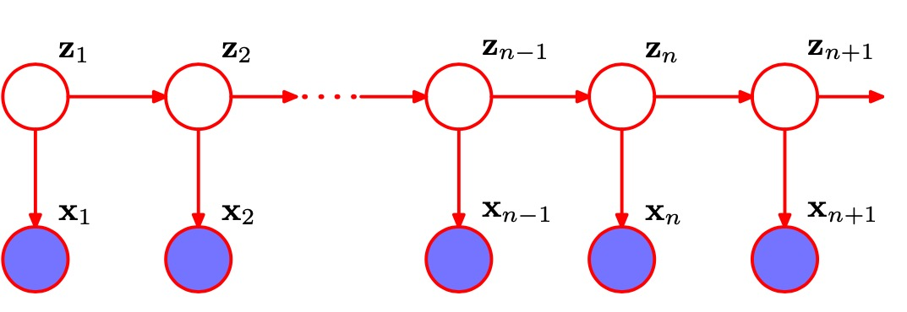

# 序列数据

之前的章节中的数据类型大多为i.i.d类型。这种近似下，最大似然方程可以表达为独立点似然函数的乘积。而本节则会考虑序列数据。比如时间序列数据，DNA序列数据，英文序列数据。

序列数据分为两种，静态序列和动态序列。其中静态序列的分布不随序列变化，而动态序列中的分布随着时间变化。

很多模型中，数据点受近邻点的影响要比遥远的过去的点要大很多，而考虑整个序列又会导致计算复杂度过快增长。所以我们通常会做些简化比如马尔科夫链。然而这些模型的限制过强，所以我们可以考虑一些更为通用的框架。比如引入隐变量后的**state space model**。还有两种通用模型，**隐马尔科夫**和**线性动态模型**

## 13.1 马尔科夫模型
处理顺序数据的最简单的方式是忽略顺序的性质，将观测看做独立同分布。如图所示

然而，这种方法无法利用数据中的顺序模式，例如序列中距离较近的观测之间的相关性。 保留临近的数据对当前数据的影响，不考虑较远数据对当前数据的影响我们就能得到一个马尔科夫链模型。比如一个一阶马尔科夫链模型为：
$$p(x_1, x_2, ..., x_n) = p(x_1) \prod_{n=2}^N p(x_n| x_{n-1})$$

在这个模型中，如果我们要预测下一时刻的观测量，则只需要知道当前时刻的观测量即可。对于静态序列每个时刻的 $p(x_n|x_{n-1})$ 都相等。这又叫同质马尔科夫链。如果我们要增加更久远的信息，就要用上更高阶的马尔科夫链。比如下面是个二阶马尔可夫链

不过代价是更多的计算资源需求。对于连续变量可以使用高斯模型得到**自动回归（autoregression)**。

为了可破除观测量带来的独立性限制。一个可行的方法是像前几章一样使用隐变量模型。隐变量形成一个马尔科夫链，此时的总概率为
$$p(x_1, x_2,...x_n,z_1,z_2,...z_n) = p(z_1)[\prod_{n=2}^Np(z_n|z_{n-1})]\prod_{n=1}^N p(x_n|z_n)$$
通过隐变量，任意两个观测变量之间都不会d-seperation。

本章会讨论两种连续隐变量: 隐变量离散的**隐马尔科夫链HMM**和连续的**线性动态系统 linear dynamical system**。

## 13.2 隐马尔可夫模型
HMM广泛用于语音识别、自然语言建模、在线手写识别以及生物序列的分析。如果我们考察模型的一个单一的时间切片，那么我们看到它对应于一个混合概率分布，对应的分量密度为$p(x|z)$。于是，它也可以表述为混合概率模型的一个推广，其中每个观测的混合系数不是独立地选择的，而是依赖于对于前一次观测的分量的选择。与标准的混合模型的情形相同，潜在变量是离散的服从多项式分布的变量$z_n$，描述了那个混合分量用于生成对应的观测$x_n$。比较方便的做法是使用1-of-K表示方法，由于潜在变量是K维二值变量，因此条件概率分布对应于数字组成的表格，记作A，它的元素被称为**转移概率(transition probabilities)**。

$$p(z_n|z_{n-1}, A) = \prod_{k=1}^K\prod_{j=1}^K A_{jk}^{z_{n-1,j}z_{nk}}$$
其中初始节点:
$$p(z_1|\pi) = \prod_{k=1}^K\pi_k^{z_{1k}}$$
有时可以将状态画成状态转移图中的一个结点，这样就可以图形化地表示出转移矩阵

有时比较有用的做法是将状态转移图在时间上展开。这给出了潜在变量之间转移的另一种表示方法，被称为**晶格图(lattice diagram)**或者**格子图(trellis diagram)**。

可以通过定义观测变量的条件概率分布$p(x_n|z_n, \phi)$来确定一个概率模型，其中$\phi$是控制概率分布的参数集合。这些条件概率被称为**发射概率(emission probabilities)**。
$$p(x_n|z_n,\phi) = \prod_{k=1}^K p(x_n|\phi_k)^{z_{nk}}$$
观测变量和潜在变量上的联合概率分布为
$$p(X,Z|\theta) = p(z_1|\pi)[\prod_{n=2}^N p(z_n|z_{n-1}, A)]\prod_{m=1}^N p(x_m|z_m, \phi)$$

### 13.2.1 用于隐马尔可夫的最大似然法
确定HMM的参数有两个困难：
1. 由于联合概率分布$p(X, Z |\theta)$无法在$n$上进行分解， 因此我们不能独立地在每个$z_n$上进行求和。我们也不能显示地完成这个求和，因为有$N$个变量需要求和，每个都有$K$个状态，从而总计有$K_N$个求和项。因此求和式中的项的数量随着链的长度指数增长。
2. 由于它对应于混合概率分布的一个推广，因此它表示潜在变量的不同配置下，对发射概率进行求和。因此直接对这个似然函数进行最大化会导致复杂的表达式，没有解析解。
第一个问题：可以使用图的条件独立性质对求和式重新排序，得到一个计算代价与链的长度呈线性关系而不是指数关系的算法。第二个问题则可以用EM算法解决。

现在我们定义两个简化写法：
$$\gamma(z_n) = p(z_n | X,\theta)$$
$$\xi(z_{n-1},z_n) =p(z_{n-1}, z_n | X,\theta)$$
在E步骤中，我们使用这些参数找到潜在变量的后验概率分布$p(Z|X,\theta^{old})$。然后，我们使用这个后验概率分布计算完整数据似然函数的对数的期望，得到了一个关于参数$\theta$的函数$Q(\theta,\theta^{old})$:
$$Q(\theta, \theta^{old}) = \sum_{k=1}^K \gamma(z_{1k})\ln \pi_k +\sum_{n=2}^N\sum_{j=1}^N\sum_{k=1}^N\xi (z_{n-1,j},z_{nk})\ln A_{jk} + \sum_{n=1}^N \sum_{k=1}^K \gamma(z_{nk})\ln p(x_n|\phi_k)$$

E步骤的目标是高效计算$\gamma$和$\xi$，而在M步骤中我们关于参数$\theta = {\pi, A, \theta}$最大化$Q(\theta, \theta^{old})$，其中$\pi$和$A$很容易计算:
$$\pi_k = \frac {\gamma(z_{1k})} {\sum_{j=1}^K \gamma(z_{1j})}$$
$$A_{jk} = \frac {\sum_{n=2}^K\xi(z_{n-1,j},z_{nk})} {\sum_{l=1}^K\sum_{n=2}^K \xi(z_{n-1,j}, z_{nl})}$$
而发射项与其他项独立，我们可以简单地最大化发射概率密度$p(x|\phi_k)$的加权的对数似然函数，权值为$\gamma(z_{nk})$。

### 13.2.2 前后向算法
接下来我们寻找计算$\gamma(z_{nk})$和$\xi(z_{n−1,j},z_{nk})$的高效的方法，对应于EM算法中的E步骤，在隐马尔可夫模型这一特定的问题中，这个被称为**前向后向算法(forward-backward)算法**
$$\gamma(z_n) = p(z_n|X) = \frac{\alpha(z_n)\beta(z_n)}{p(X)}$$
$$\alpha(z_n) = p(x_1,x_2,...x_n,z_n)$$
$$\beta(z_n) = p(x_{n+1},x_{n+2},...x_N|z_n)$$
可以得到
$$\alpha(z_n) = $$

### 13.2.3 用与HMM的加和乘积算法

### 13.2.4 缩放因子

## 13.3 线性动态系统
