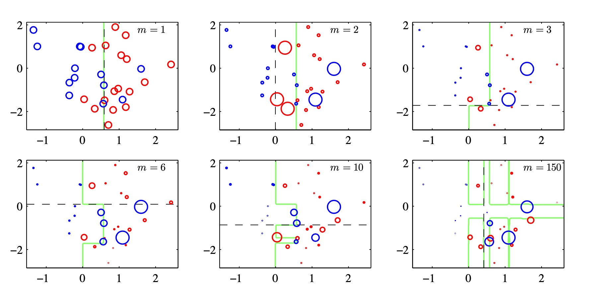
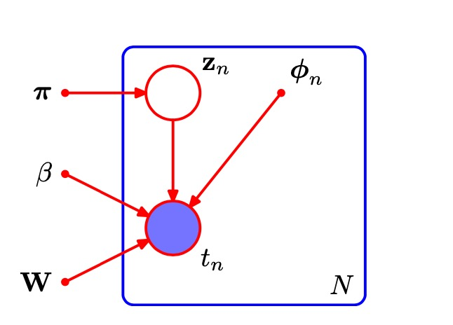

# 第十四章 组合模型
在之前的章节中，我们研究了一系列不同的模型用于解决分类问题和回归问题。经常发现的一件事情是，我们可以通过以某种方式将多个模型结合到一起的方法来提升性能，而不是独立地使用一个单独的模型。例如，我们可以训练L个不同的模型，然后使用每个模型给出的预测的平均值进行预测。这样的模型的组合有时被称为**委员会(committee)**。委员会方法的一个重要的变体，被称为**提升方法(boosting)**。这种方法按顺序训练多个模型，其中用来训练一个特定模型的误差函数依赖于前一个模型的表现。与单一模型相比，这个模型可以对性能产生显著的提升。与对一组模型的预测求平均的方法不同，另一种形式的模型组合是选择一个模型进行预测，其中模型的选择是输入变量的一个函数。因此不同的模型用于对输入空间的不同的区域进行预测。这种方法的一种广泛使用的框架被称为**决策树(decision tree)**。决策树的一个局限性是对于输入空间的划分基于的是一种硬划分，对于输入变量的任意给定的值，只有一个模型用于做出预测。通过将一个概率框架用于模型组合，决策的过程可以被软化。这样的模型可以被看成混合概率分布，其中分量的概率密度以及混合系数都以输入变量为条件，被称为专家混合(mixture of experts)。

## 14.1 贝叶斯模型平均
将模型组合方法与贝叶斯模型平均方法区分开是很重要的，这两种方法经常被弄混淆。模型组合中
$$p(x) = \sum_z p(x,z)$$
比如在混合高斯模型中
$$p(x) = \sum_{k=1}^K \pi_k N (x | \mu_k, \Sigma_k)$$
对于数据集有：
$$p(X) = \prod_{n=1}^N [\sum_{z_n} p(x_n, z_n)]$$
因此我们看到，每个观测数据点$x_n$有一个对应的潜在变量$z_n$。而在贝叶斯平均上，
$$p(X) = \sum_{h=1}^H p(X|h) p(h)$$
只有一个模型用于生成整个数据集，$h$上的概率分布仅仅反映了我们对于究竟是哪个模型用于生成数据的不确定性。随着数据集规模的增加，这个不确定性会减小，后验概率分布$p(h|X)$会逐渐集中于模型中的某一个。

## 14.2 委员会
构建一个委员会的最简单的方法是对一组独立的模型的预测取平均。这样的方法的动机可以从频率学家的观点看出来。这种观点考虑偏置和方差之间的折中，它将模型的误差分解为偏置分量和方差分量，其中偏置分量产生于模型和真实的需要预测的函数之间的差异，方差分量表示模型对于单独的数据点的敏感性。

比如**自助(bootstrap)**数据集。考虑一个回归问题，其中我们试图预测一个连续变量的值，并且假设我们生成了$M$个自助数据集然后使用每个数据集训练处了预测模型的一个独立的副本$y_m(x)$，其中$m=1,...,M$。委员会预测为:
$$y_{COM}(x) = \frac 1 M \sum_{m=1}^M y_m(x)$$
这个显然具有戏剧性的结果表明，一个模型的平均误差可以仅仅通过对模型的$M$个版本求平均的方式减小$M$倍。不幸的是，它依赖于我们的关键假设，即由各个单独的模型产生的误差是不相关的。在实际应用中，误差通常是高度相关的，因此整体的误差下降是通常是很小的。然而，可以证明，委员会误差的期望不会超过各个分量模型的期望误差，即$E_{COM}≤ E_{AV}$。为了得到更显著的提升，我们转向一种更加复杂的构建委员会的方法，被称为提升方法。

## 14.3 提升方法
这里介绍提升方法的最广泛使用的一种形式，被称为AdaBoost，是**可调节提升方法(adaptive boosting)**的简称。提升方法和委员会方法(例如上面讨论的打包方法)的主要不同在于，基分类器是顺序训练的，每个基分类器使用数据集的一个加权形式进行训练，其中与每个数据点相关联的权系数依赖于前一个分类器的表现。

考虑一个二分类问题，其中训练数据由输入向量$x_1,...,x_N$以及对应的二值目标变量$t_1,...,t_N$组成，其中$t_n∈{−1,1}$。每个数据点被赋予了一个关联的权值参数$w_n$，对于所有
的数据点，它都被初始化为$N$。我们假设我们有一个使用加权数据训练基分类器的方法，得到函数$y(x) ∈ {−1, 1}$。在算法的每个阶段，AdaBoost使用一个数据集训练一个新的分类器，其中权系数根据前一个训练的分类器的表现进行调节，从而为误分类的数据点赋予更高的权值。最后，当我们训练了所需数量的基分类器之后，它们进行组合，形成一个委员会，组合的系数会为不同的基分类器赋予不同的权值。AdaBoost算法的精确形式叙述如下。

1. 初始化数据加权系数${w_n}$，方法是对$n=1,...,N$，令$w_n^{(1)} = \frac 1 N$。
2. 对于$m = 1,...,M$:
    - 使用训练数据调节一个分类器$y_m(x)$，调节的目标是最小化加权的误差函数
        $$J_m = \sum_{n=1}^N w_n^{(m)} I(y_m(x_m) \neq t_n)$$
    - 计算
    $$\epsilon_m = \frac{\sum_{n=1}^N w_n^{(m)} I(y_m(x_m) \neq t_n)}{\sum_{n=1}^N w_n^{(m)}}$$
    然后计算
    $$\alpha_m=\ln \{\frac {1 - \epsilon_m}{\epsilon_m} \}$$
    - 更新权重
    $$w_n^{(n+1)} = w_n^{(m)} \exp \{ \alpha_m I(y_m(x_n)\neq t_n) \}$$

3. 使用最终的模型进行预测，形式为

$$Y_M(x) = sign(\sum_{m=1}^M\alpha_m y_m(x))$$

### 14.3.1 最小化指数误差

提升方法最早起源于统计学习理论，得到了泛化误差的上界。然而，这些上界过于宽松，没有实际的价值。提升方法的实际表现要远优于上界给出的值。本节根据对一个指数误差函数的顺序最小化，给出了提升方法的一个不同的且非常简单的表述。

### 14.3.2 提升方法的误差函数

因此AdaBoost算法是在由基分类器的线性组合表示的函数空间中，寻找对log odds的最好的近似，对应于顺序最优化策略下的受限最小化。这个结果说明了在公式中使用符号函数得到最终的分类决策的原因。

## 14.4 基于树的模型
有许多简单但广泛使用的模型，它们将输入空间划分为超立方体区域，超立方体的边与坐标轴对齐，然后为每个区域分配一个简单的模型(例如，一个常数)。这些模型可以被看成一种模型组合方法，其中只有一个模型对于输入空间中任意给定点的预测起作用。给定一个新的输入x，选择一个具体的模型的过程可以由一个顺序决策的过程描述，这个过程对应于对一个二叉树(每个节点划分为两个分支的树)的遍历。这里，我们关注一个特定的基于树的框架，被称为**分类与回归树(classification and regression tree)**，或者**CART**，虽然还有很多其他的变体，例如ID3和C4.5。

考虑如何确定决策树的结构。通常使用贪心的最优化。从对应于整个输入空间的一个单独的根结点开始，然后通过每次添加一个结点的方式构建树。在每一步，输入空间中会有若干个可以切分的候选的区域，对应于向当前的树中添加一对叶结点。

得到构建树的贪心策略之后，剩下的问题是如何停止添加结点。一个简单的方法是当残留误差的减小量低于某个阈值时停止。然而，我们通过实验发现，经常出现这样的情形:没有划分方式会使误差函数产生显著的减小，但是再进行几次划分之后，就会找到一个使误差函数显著减小的划分方式。因此，在实际应用中通常构建一个较大的树，使用基于与叶结点关联的数据点数量的停止准则，然后进行剪枝，生成最终的树。

## 14.5 条件混合模型

我们已经看到，标准的决策树被限制为对输入空间的硬的、与坐标轴对齐的划分。这些限制可以通过引入软的、概率形式的划分的方式得到缓解，这些划分是所有输入变量的函数，而不仅仅是某个输入变量的函数。这样做的代价是它的直观意义的消失。

### 14.5.1 线性回归模型的混合

用概率形式表示线性回归模型的众多优点之一是它可以用作更复杂的概率模型的一个分量。例如，将表示线性回归模型的条件概率分布看成有向概率图中的一个结点，即可完成这件事。

## 14.6 logistic模型的混合

由于线性回归模型定义了给定输入变量的条件下目标变量的一个条件概率分布，因此很容易将其用作混合模型中的分量分布，从而与单一的logistic回归模型相比，可以表示更丰富的一类条件概率分布。这个例子涉及到对本书前面章节讨论的思想的一个直接组合，有助于帮助读者巩固这些知识。

### 14.6.1 专家混合
虽然这些简单的混合扩展了线性模型的灵活程度，包含了更复杂的(例如多峰的)预测分布，但是它们仍然具有很大的局限性。我们可以进一步增强这些模型的能力，方法是使得混合系数本身是输入变量的函数，即:

$$p(t|x) = \sum_{k=1}^K \pi_k(x)p_k(t|x)$$
这被称为**专家混合(mixture of experts)模型**。其中混合系数$\pi_k(x)$被称为**门函数(gating function)**，各个分量密度$p_k(t|x)$被称为**专家(expert)**。