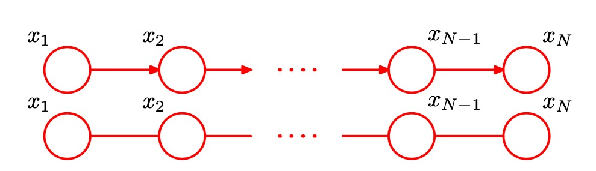

# 第八章 图模型
概率论在模式识别中占有重要地位，概率论可以由**sum rule**和**product rule**两个简单方程组合而成。我们可以使用这两个公式构建任意复杂的概率模型，但是这种方法很不直观，所以我们发明了图表示来化简这一过程。这种概率分布的图模型被成为概率图模型，它有以下特点

- 它们提供了一种简单的方式将概率模型的结构可视化，可以用于设计新的模型。
- 通过观察图形，我们可以更深刻地认识模型的性质，包括条件独立性质。
- 高级模型的推断和学习过程中的复杂计算可以根据图计算表达，图隐式地承载了背后的数学表达式。

一个图由 **结点(nodes)** 或者 **端点(vertices)** 和它们之间的 **链接(links)** 也被称为 **边(edges)** 或 **弧(arcs)** 组成。在概率图模型中，每个结点表示一个随机变量，链接表示这些变量之间的概率关系。图可以分成 **贝叶斯网络(Bayesian network)** 也被称为 **有向图模型(directed graphical model)** 和 **马尔科夫随机场 (Markov random fields)** 也被称为 **无向图模型(undirected graphical models)** 。了求解推断问题，通常比较方便的做法是把有向图 和无向图都转化为一个不同的表示形式，被称为 **因子图(factor graph)**。

## 8.1 贝叶斯网络
实际上，图模型的一个强大的方面是，一个具体的图可以描述一大类概率分布。通过使用概率的乘积规则，可以将$p(a,b,c)$分解为$p(a)p(b|a)p(c|b,a)$ 这样做的时候隐式的选择了一个特定的分解顺序。在图中我们为$a,b,c$关联上节点，而为条件概率关联上边，这个图是 **全联接的(full connected)**的，因为每两个节点之间都有边相连。诸如:

$$p(x_1)p(x_2)p(x_3)p(x_4|x_1,x_2,x_3)p(x_5|x_1,x_3)p(x_6|x_4)p(x_7|x_4,x_5) $$

的表达式可以用图

 

来表示，对于一个有K个节点的图，其概率由
$$p(x) = \prod_{k=1}^K p(x_k|pa_k)$$
来表示，其中$pa_k$表示$k$节点的所有父节点。$x = \{x_1, x_2, ... x_K\}$，这个关键的方程表示有向图模型的联合概率分布的 **分解(factorization)** 属性。如果每概率都是归一化的则联合概率分布也是归一化的。有向图又一个重要的限制 -- 不能存在 **有向环(directed cycle)** 。这种图又被成为 **有向无环图(directed acyclic graph)** ，或者 **DAG**。

### 8.1.1 多项式回归
考虑贝叶斯多项式拟合模型，这个模型中的随机变量是多项式系数向量$w$和观测数据$t = (t_1, ..., t_N )^T$，此外模型还包含输入$x = (x_1, ..., x_N)^T$，噪声方差$\sigma^2$和$w$的高斯先验精度超参数$\alpha$。我们可以在图表示中显式地写出$x$和$\alpha$。为了这样做，我们会遵循下面的惯例:随机变量由空心圆表示，确定性参数由小的实心圆表示。在图模型中，我们通过给对应的结点加上阴影的方式来表示这种 **观测变量(observed variables)**。注意，$w$不是观测变量，因此$w$是 **潜在变量 (latent variable)** 的一个例子。潜在变量也被称为 **隐含变量(hidden variable)**。观测到$t_n$的值以后我们可以通过贝叶斯定理得到
$$p(w|t) \propto p(w)\prod_{n=1}^N p(t_n|w) $$
我们系统通过$w$来对新的$\hat x$ 进行预测。 最后整个多项式拟合的模型可以表示成

$$ p(\hat{t} |\hat x, x, t, \alpha, \sigma^2)  \propto \int p(\hat t, t , w |  \hat x, x,\alpha, \sigma^2 ) dw $$

 

其中$t_n,x_n$所在的区域被成为 **板(plate)** 的方框圈起来，标记为N，表示有N个同类型的点。

### 8.1.2 生成模型

**ancestral sampling**： 按照分布依赖关系，一个接一个采样，采样的概率为 $p(x_n|pa_n)$, 其中父节点的采样结果已知。这种方法可以在简化数据生成的同时，生成分布更复杂的模型。

对于概率模型的实际应用，通常的情况是，数量众多的变量对应于图的终端结点(表示观测值)，较少的变量对应于潜在变量。潜在变量的主要作用是使得观测变量上的复杂分布可以表示为由简单条件分布(通常是指数族分布)构建的模型。概率模型中的隐变量不必具有显示含义。

图模型描述了生成观测数据的一种 **因果关系(causal)** 过程。因此，这种模型通常被称为 **生成式模型(generative model)** 。上文多项式模型不是生产模型，因为图不包含数据$x$产生的概率。通过引入$p(x)$可以将上一节的模型变成生成模型。

### 8.1.3 离散变量
如果我们将有向图中的每个父结点-子结点对的关系选为共轭的，那么这样的模型有一些特别好的性质，本节介绍都为离散变量的例子，下一节介绍都为高斯变量的情况。

对离散变量，在全联接图模型中，多条边代表多重依赖，对于依赖N条有K个不同值的边的节点，其参数为$K^N-1$。而对全独立变量，参数为$NK$量级，全连接无法计算，全独立受限太严重，我们一般会取中间状态。比如每个节点一一连接，或者参数共享来减少总参数个数。还有一个办法就是使用类似logistic regresssion的方式，将多条边的依赖聚和成一条边的依赖，让多个父节点和一个单一自节点构成图。

### 8.1.4 线性高斯模型
我们将说明多元高斯分布如何表示为一个对应于成分变量上的线性高斯模型的有向无环图。几种广泛使用的方法是线性高斯模型的例子，例如概率主成分分析，因子分析，以及线性动态系统。

考虑D个变量上的任意有向无环图，其中节点i表示服从高斯分布的一元随机变量$x_i$其概率为：
$$p(x_i | pa_i) = N(x_i| \sum_{j\epsilon pa_i} w_{ij}x_j + b_i, v_i)$$
其中$w_{ij}, b_i$为控制参数，$v_i$是条件概率分布的方差。则联合概率分布的对数为
$$ \ln p(x) = - \sum_{i=1}^D \frac 1 {2v_i} (x_i - \sum_{j\epsilon pa_i} w_{ij}x_j - b_i)^2 + const$$ 
为一个多元高斯分布，可以递归确定每个变量的均值与方差。
$$E[x_i] = \sum_{j\epsilon pa_i} w_{ij}E[x_j] + b_i$$
$$cov[x_i, x_j] = \sum_{k\epsilon pa_j} w_{jk}cov[x_i, x_k] + I_{ij}v_j $$
这种构造过程原则上可以延伸到任意层次。这个模型是层次 **贝叶斯模型(hierarchical Bayesian model)*8 的一个例子，我们会在后续章节中遇到这个模型的更多例子。

## 8.2 条件独立
如果 $p(a|b,c) = p(a|c)$ 则我们称a给定c时与b条件独立。条件独立在模式识别中拥有重要的意义。或者写成 $A⫫ B |C$。条件独立从图中图模型中可以一眼看出而无需计算。这种方法的框架叫**d-separation**d表示directed。模式识别中，使用概率模型时，条件独立性起着重要的作用。它简化了模型的结构，降低了模型的训练和推断的计算量。

### 三个模型

- **tail-to-tail**: 这样的一个连接结点a和结点b的路径的存在使得结点相互依赖。然而，当我们以结点c为条件时，被用作条件的结点“阻隔”了从a到b的路径，使得a和b变得(条件)独立了。`没观测时a,b不独立，观测c后ab独立。`

- **head-to-tail**:这样的一个路径连接了结点a和结点b，并且使它们互相之间存在依赖关系。如果我们现在观测结点c，那么这个观测“阻隔”了从a到b的路径，因此我们得到了条件独立性质。`没观测时a,b不独立，观测c后ab独立。`

- **head-to-head**:当结点c没有被观测到的时候，它“阻隔”了路径，从而变量a和b是独立的。然而，以c为条件时，路径被“解除阻隔”，使得a和b相互依赖了。`没观测c时ab独立，观测c后ab不独立。`

head2head 还有一个性质，如果存在从结点x到结点y的一条路径，其中路径的每一步都沿着箭头的方向，那么我们说结点y是结点x的 **后继(descendant)** 。这样，可以证明，在一个头到头的路径中，如果任意结点或者它的任意一个后继被观测到，那么路径会被“解除阻隔”。
总之，一个尾到尾结点或者头到尾结点使得一条路径没有阻隔，除非它被观测到，之后它就阻隔了路径。相反，一个头到头结点如果没有被观测到，那么它阻隔了路径，但是一旦这个结点或者至少一个后继被观测到，那么路径就被“解除阻隔”了。

### 8.2.2 D-separation
要知道一个有向无环图是否暗示了一个特定的条件依赖表述 $A⫫ B | C$。考虑从A中任意结点到B中任意结点的所有可能的路径。我们说这样的路径被“阻隔”，如果它包含一个结点满足下面两个性质中的任何一个。
- 路径上的箭头以头到尾或者尾到尾的方式交汇于这个结点，且这个结点在集合C中。
- 箭头以头到头的方式交汇于这个结点，且这个结点和它的所有后继都不在集合C中。

如果所有的路径都被“阻隔”，那么我们说C把A从B中d-划分开，且图中所有变量上的联合概率分布将会满足$A⫫ B | C$。

> `i.i.d` 对应**tail2tail**模式，每次观测互相独立。
$$p(D|\mu) = \prod_{n=1}^N p(x_n|\mu)$$

以$\mu$为条件则，事件相互独立，而如果将先验概率积分起来，$\mu$为未知量则新观测值显然与之前的观测值相关。

> `朴素贝叶斯`标签为$z$,观测向量为$x =(x_1,x_2,...,x_D)^T$。给定类别$z$的情况下，$x_i$与$x_j$是独立的，而如果，对$z$积分则不独立。

`滤波器未看明白`

## 8.3 马尔科夫随机场
**马尔科夫随机场**又被成为**马尔科夫网络**或者**无向图模型**，包含一组结点，每个结点都对应着一个变量或一组变量。链接是无向的，即不含有箭头。

### 8.3.1 条件独立属性
在有向图中可以使用 d-separition 对一个图测试是否存在特定的条件独立。而条件独立取决于之间路径是否被堵塞，路径堵塞又多种情况。而在无向图中可以用简单的图分割判断。

在一个无向图中， $A ⫫ B | C$ 在AB之间所有连接路径都经过C时成立。另一个解决方案是将C中的节点移除。比如上图中C堵塞的所有AB之间路径。

无向图的马尔科夫毯的形式相当简单，因为结点只条件依赖于相邻结点，而条件独立于任何其他的结点。

### 8.3.2 分解属性

**团块clique**：团内所有成员两两相连。 

**最大团块 maximal clique**：不可能将图中的任何一个其他的结点包含到这个团块中而不破坏团块的性质。上图两个最大团块$x_1,x_2$和$x_2,x_3,x_4$

团块C内的成员$x_C$的概率可以表示为
 
 $$p(x) = \frac 1 Z \prod_C \phi_c(x_c)$$

 Z为归一化函数，又叫 **划分函数 (partition function)** ，$\phi_c$ 为任意>0方程叫做势能方程。归一化常数的存在是无向图的一个主要的缺点。如果我们的模型中有M个离散结点，每个结点有K个状态，那么归一化项的计算涉及到对 $K^M$ 个状态求和。计算量指数增长，不过在局部条件概率我们可以不计算划分函数。

 由于我们的势函数被限制为严格大于零，因此将势函数表示为指数的形式更方便，
 $$\phi_c(x_c) = exp \{ -E(x_c)\}$$
 其中$E(x_c)$被称为能量函数，指数表示称为玻尔兹曼分布。与有向图的联合分布的因子不同，无向图中的势函数没有一个具体的概率意义。虽然这使得选择势函数具有更大的灵活性，因为没有归一化的限制，但是这确实产生了一个问题，即对于一个具体的应用来说，如何选择势函数。可以这样做:将势函数看成一种度量，它表示了局部变量的哪种配置优于其他的配置。具有相对高概率的全局配置对于各个团块的势函数的影响进 行了很好的平衡。

### 8.3.3 例子：图像去噪

图像值为$x_i$，观测值为$y_i$数值是固定的，其中i为图像D中的点，则能量函数为：
$$E(x, y) = h\sum_i x_i - \beta \sum_{i,j} x_ix_j - \lambda \sum_i x_iy_i$$

它定义了一个X,Y上连联合概率分布，$x_ix_j$中ij为相邻的点。求解方法为使用一个简单的迭代方法 **迭代条件峰值(iterated conditional modes)** ，或者称为ICM。这种方法仅仅是坐标间的梯度上升方法的一个应用。

### 8.3.4 和有向图的关联
 有向图转成无向图，对于只有一个父节点的节点可以简单将$p(a|b)$ 转变成 $p(a,b)$。而对于有多个父节点的情况，则要求所有父节点属于同一个团，所以有$p(a|b,c,d)$ 转换成$p(a,b,c,d)$。这种将父节点两两相连的操作叫做**moraliztion**。所得的图叫做**moral graph**。有些有向图无法用无向图表达，有些无向图无法用有向图来表达。

 在有向图转为无向图的过程中，我们必须确保出现在每个条件概率分布中的变量的集合是无向图中至少一个团块的成员。而且对于有多个父节点的情况，必须保证这些父节点属于同一个团块。使用一种过时的说法，这种“与父结点结婚”的过程被称为 **伦理(moralization)** ，去掉箭头后生成的无向图被称为 **道德图(moral graph)** 。很重要的一点是，这个例子中的道德图是完全链接的，因此没有表现出条件独立性质，这与原始的有向图相反。

总之这个过程可以描述为：
1. 首先在图中每个结点的所有父结点之间添加额外的无向链接，然后去掉原始链接的箭头，得到道德图。
2. 然后将道德图的所有的团块势函数初始化为1。
3. 接下来拿出原始有向图中所有的条件概率分布因子，将它乘到一个团块势函数中去。

> 从一个无向图转化到有向图表示不太常用，通常表示归一化限制中出现的问题。

如果一个概率分布中的所有条件独立性质都通过一个图反映出来，那么这个图被称为这个概率分布的 **D图(dependency map)** 。因此一个完全非连接的图(不存在链接)是任意概率分布的平凡D图。

如果一个图的每个条件独立性质都可以由一个具体的概率分布满足，那么这个图被称为这个概率分布的 **I图(independence map)** 。一个完全连接的图是任意概率分布的平凡I图。

如果概率分布的每个条件独立性质都由可以由图反映出来，反之也成立，那么这个图被称为是概率分布的**完美图(perfect map)** 。于是，一个完美图既是I图又是D图。

## 8.4 图模型的推论

图a是 $p(x, y) = p(x) p(y|x)$的分解，图b是节点a已经观测到的情况，图c是通过贝叶斯定理利用y反推x的情况。

### 8.4.1 链的推论

对于有向链图
$$p(x_1,x_2,...,x_n) = p(x_1)p(x_2|x_1)p(x_3|x_2)...p(x_n|p(x_n-1)$$

可以转为无向链图
$$p(x_1,x_2,...x_n) = \frac 1 Z \phi(x_1, x_2) \phi(x_2,x_3) ... \phi(x_n, x_n-1) $$

如果其中每个x都是离散变量有K个取值，则每个$\phi$函数可以表示为一个KXK的表，最后整个模型有$NK^2$个参数。为了计算边缘概率分布$p(x_n) = \sum_{x_1}\sum_{x_2} ... \sum_{x_{n-1}}\sum_{x_{n+1}}...\sum_{x_N}p(x)$其计算复杂度为$K^N$如果使用类似动态规划算法,i可以将复杂度降低到$NK^2$量级。

$$p(x_{n-1}, x_n) = \frac 1 Z \mu_{\alpha}(x_{n-1})\phi_{n-1}, n(x_{n-1},x_n)\mu_{\beta}(x_n)$$

$$\mu_{\alpha}(x_n) = \sum_{x_n-1} \phi_{n-1,n}(x_n-1,x_n)\mu_{\alpha}(x_{n-1})$$
$$\mu_{\beta}(x_n) = \sum_{x_n+1} \phi_{n+1,n}(x_n+1,x_n)\mu_{\beta}(x_{n+1})$$

### 8.4.2 树
无向图- 没有环的称为树
有向图- 每个节点只有一个父节点，只有一个根节点没有父节点。
有向图- 可以由多个父节点，有多个根节点叫**polytree（超树）**

### 8.4.3 因子图

有向图和无向图都使得若干个变量的一个全局函数能够表示为这些变量的子集上的因子的乘积。因子图显式地表示出了这个分解，方法是:在表示变量的结点的基础上，引入额外的结点表示因子本身。因子图也使我们能够更加清晰地了解分解的细节。

在因子图中，概率分布中的每个变量都有一个结点(用圆圈表示)，这与有向图和无向图的情形相同。还存在其他的结点(用小正方形表示)，表示联合概率分布中的每个因子$f_s(x_s)$。在每个因子结点和因子所依赖的变量结点之间，存在无向链接。例子：

因子图分解时将$p(x) = f_a(x_1, x_2)f_b(x_1,x_2)f_c(x_2,x_3)f_d(x_3)$每个$f_a,f_b,f_c,f_d$分解成一个方块，每个变量$x_1,x_2,x_3$还是一个圈，最后圈和方块相连。由于因子图由两类不同的结点组成，且所有的链接都位于两类不同的结点之间，因此因子图被称为 **二分的(bipartite)**。同一个有向图或者无向图可能存在多个不同的因子图。

### 8.4.4 加和(sum-product)算法
假设原始的图是一个无向树或者有向树或者多树，从而对应的因子图有一个树结构。首先，将原始的图转化为因子图，这就去除了有向无向图的差异。我们的目标是利用图的结构完成两件事:
1. 得到一个高效的精确推断算法来寻找边缘概率。 
2. 在需要求解多个边缘概率的情形，计算可以高效地共享。

对特定节点x其边缘概率由 $p(x)=\sum_{X/x}p(X)$ 给出，其中$X/x$为除了x外所有节点。

使用因子图可以将上式改成$p(x) = \prod_{s \epsilon ne(x)} F_s(x, X_s)$，其中$ne(x)$是$x$相邻因子节点集合，$X_s$则是通过因子节点$s$与$x$相连对节点集合。$F_s(x, X_s)$表示所有与因子$f_s$关联的因子的乘积，带入上面公式可以得到

$$p(x) = \prod_{s \epsilon ne(x)} \mu_{f_s->x}(x)$$

其中$\mu_{f_s->x}(x) = \sum_{X_s}F_s(x, X_s)$是通过$f_s$传递给x的信息。

而$F_s(x, X_s)$本身分解后可以得到

$$\mu_{f_s->x}(x) = \sum_{x_1}\sum_{x_2}...\sum_{x_M}f(x,x_1,x_2,...x_M)\prod_{m \epsilon ne(f_s)/x}\mu_{x_m->f_s}(x_m)$$

其中

$$\mu_{x_m->f_s}(x_m) = \prod_{l \epsilon ne(x_m)/f_s} \mu_{f_l -> x_m} (x_m)$$

所以有两种不同信息一种通过$f_s->x$一种通过$x->f_s$，一个变量结点通过一个链接发送到一个因子结点的信息可以按照如下的方式计算:

> 计算沿着所有进入因子结点的其他链接的输入信息的乘积，乘以与那个结点关联的因子，然后对所有与输入信息关联的变量进行求和。值得注意的是，一旦一个因子结点从所有其他的相邻变量结点的输入信息，那么这个因子结点就可以向变量结点发送信息。

> 为了计算从一个变量 结点到相邻因子结点沿着链接传递的信息，我们只需简单地在其他所有结点上对输入信息取乘积。

信息递归传到一直到叶节点，如果叶节点是变量则有$\mu_{x->f_s}(x)=1$如果叶节点是因子节点则有$\mu_{f_s->x}(x)=f(x)$

### 8.4.5 最大加和算法
有两个其他的比较常见的任务，即找到变量的具有最大概率的一个设置，以及找到这个概率的值。这里要求的是联合概率最大的值和概率。类似加和算法可以基于信息传递写出最大化加和算法，只需把“加和”替换为“最大化”，把“乘积”替换为对数求和即可。

$$\mu_{f->x}(x) = max_{x_1,x_2,...x_M}[\ln f(x_1,x_2,...x_M) + \sum_{m \epsilon ne(f)/s} \mu_{x_m ->f}(x_m)]$$
$$\mu_{x->f}(x) = \sum_{l \epsilon ne(x)/f} \mu_{f_l ->x}(x)]$$

如果叶节点是变量则有$\mu_{x->f_s}(x)=0$如果叶节点是因子节点则有$\mu_{f_s->x}(x)=\ln f(x)$，而如果要得出最大概率时图中节点的值，则需要利用反向传播的方式对路线进行追进行。这种方法的一个重要应用是寻找隐马尔科夫模型中隐含状态的最可能序列，这种情况下被称为Viterbi算法。

### 8.4.6 一般图的精确推断

加和-乘积算法和最大化加和算法提供了树结构图中的推断问题的高效精确解法。然而，对于许多实际应用，我们必须处理带有环的图。信息传递框架可以被推广到任意的图拓扑结构，从而得到一个精确的推断步骤，被称为 **联合树算法 (junction tree algorithm)**。

### 8.4.7 置信循环传播
对于许多实际应用问题来说，使用精确推断是不可行的，因此我们需要研究有效的近似方法。这种近似方法中，一个重要的类别被称为 **变分(variational)** 方法，将在第10章详细讨论。作为这些确定性方法的补充，有一大类 **取样(sampling)** 方法，也被称为 **蒙特卡罗(Monte Carlo)** 方法。这些方法基于从概率分布中的随机数值取样，

### 8.4.8 学习图结构

在我们关于图模型的推断的讨论中，我们假设图的结构已知且固定。然而，也有一些研究超出了推断问题的范围，关注于从数据推断图结构本身。