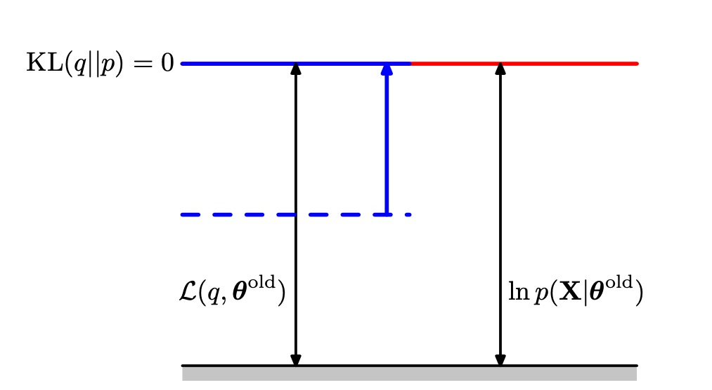
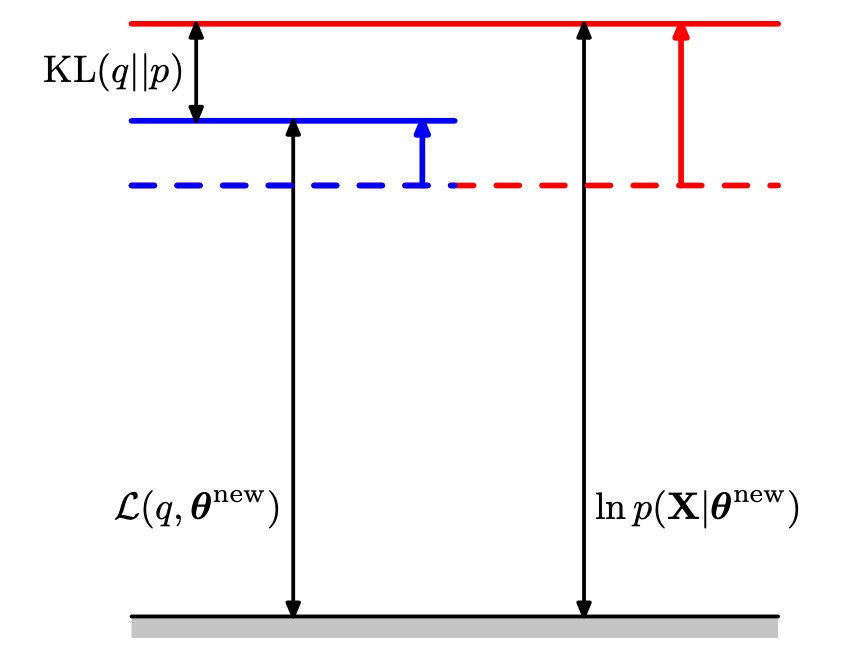
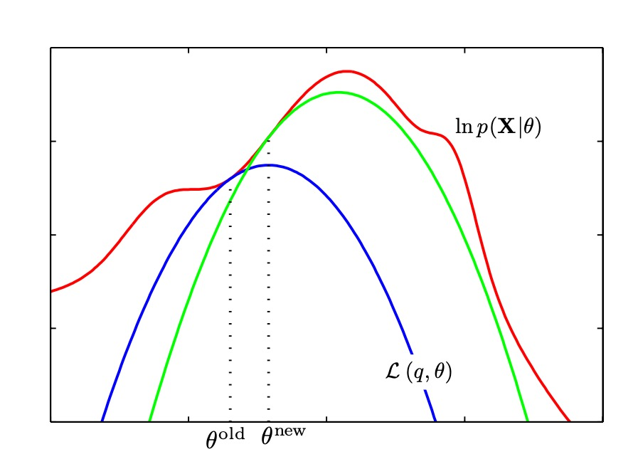

# 第九章 混合模型和EM
对于可观测量和隐变量，可观测量的分布可以通过计算边缘概率积分掉隐变量获得。通过隐变量可以从简单模型构成复杂模型，混合分布比如高斯混合可以被分解为分立的隐变量。不光提供构成复杂模型的方法，混合模型还可以用来聚类。本章寻找隐变量模型最大似然估计的通用方法叫EM（最大期望算法），最大似然方法有一些巨大的局限性。在下一章中，使用变分推断的方法，可以得到一个优雅的贝叶斯处理方式。与EM相比，这种方法几乎不需要额外的计算量，并且它解决了最大似然方法中的主要困难，也使得混合模型的分量的数量可以自动从数据中推断

## 9.1 k-means 聚类
聚类的目标方程为：

$$J = \sum_{n=1}^N \sum_{k=1}^K r_{nk}||x_n - \mu_k||^2$$
其中$x_n$是数据点，$r_{nk}$为 1-of-K 编码，$n$是数据点，$k$是类别如果这个值等于1则表示相应数据点被分给特定类别。$\mu_k$ 为中心点。k-means 分两步，第一步更新$r_{nk}$ ，第二步更新$\mu_k$。这两步分别对应EM 算法中的 **E(Execptation)** 和 **M(Maximization)**。在更新$r_{nk}$时可以将其设为:
$$r_{nk} = 1 ,k = argmin_j||x_n - \mu_j||^2$$
$$r_{nk} = 0 ,other$$
就是距离$x_n$最近的中心为$x_n$属于的类别，而在更新$u_j$时可以得到
$$\mu_k = \frac {\sum_n r_{nk}x_n}{\sum_nr_{nk}}$$
因此这个结果有一个简单的含义，即令$\mu_k$等于类别$k$的所有数据点的均值。
由于每个阶段都减小了目标函数$J$的值，因此算法的收敛性得到了保证。然而，算法可能收敛到$J$的一个局部最小值而不是全局最小值。

K-means算法还可以进行在线更新。具体方法为
$$\mu^{new}_k = \mu^{old}_k +\lambda_n (x_n -\mu_k^{old})$$

在k-means中的欧几里得距离限制了其性能，导致其在处理类目数据和一些其他工作时表现不好，所以可以改进为**k-medoid**算法使用其他的距离表示函数代替欧式距离。k-means算法的E步骤的复杂度为O(KN)，M步骤为O($N_K^2$)。E步骤每个数据都强制属于一个分类，这导致一些边缘数据比较麻烦。

### 9.1.1 图像分割和压缩
图像分割：将图像点分成K类，然后分别用K类中心替代。
图像压缩：方法和分割类似。有另一个名字（向量量化vector-quantization），而$\mu_k$叫做**code-book vectors**

## 9.2 高斯混合
高斯混合模型可以写成
$$p(x) = \sum_z p(z) p(x|z)= \sum_{k=1}^K\pi_k N(x|\mu_k, \Sigma_k)$$  
其中$z_k$ 为 1-of-K表示{0, 0, 0, 0, ... , 1 , 0, 0, 0}其值根据混合系数赋值$p(z_k = 1 ) = \pi_k$
$$p(z) = \prod_{k=1}^K \pi_k^{z_k}$$
$$p(x|z) = \prod_{k=1}^K N(x|\mu_k, \Sigma_k)^{z_k}$$
这样，我们找到了高斯混合分布的一个等价的公式，将潜在变量显式地写出。现在，我们现在能够对联合概率分布$p(x,z)$操作，而不是对边缘概率分布$p(x)= \sum_zp(x,z)$操作，这会产生极大的计算上的简化。另一个重要做用量是给定$x$时z的条件概率。
$$\gamma(z_k) = \frac {\pi_k N(x|\mu_k, \Sigma_k)}{\sum_j \pi_j N(x|\mu_j, \Sigma_j)}$$
我们可以使用祖先取样的方法生成服从高斯混合模型的概率分布的随机样本。首先从概率$p(z)$生成一个$\hat z$然后从概率$p(x|\hat z)$生成。

### 9.2.1 最大似然
对于iid数据$\big\{x_1,x_2,x_3...x_n\big\}$其对数似然函数为

$$ln(p(X| \pi, \mu, \Sigma) = \sum_{n=1} ^N \ln\big\{\sum_{k=1}^K\pi_kN(x_N| \mu_k, \Sigma_k ) \big\}$$

混合高斯分布在方差无限小时，分布概率会无限大。在单高斯分布时不会有这个问题，因为其他点的概率会趋近于0，导致最后的联合概率并不高。这也是一种过拟合，使用贝叶斯理论后会消失。还有另一个问题是：寻找每个类目的标签可以互换，K个类目有K!种等价表示方式。

### 9.2.2 高斯混合EM
EM是一种解高斯混合最大期望的有效方法。

$$\gamma(z_{nk}) = \frac{\pi_k N(x_n|\mu_k, \Sigma_k)}{\sum_{j=1}^N \pi_j  N(x_n|\mu_j, \Sigma_j)}$$
对其求$\mu_k, \Sigma_k, \pi_k$偏导 可以得到 
$$\mu_k = \frac 1 N_k \sum_{n=1}^N \gamma(z_{nk})x_n$$ 
其中$N_k = \sum_{n=1}^N\gamma(z_{nk})$为分配到聚类k的数据点的有效数量。第$k$个高斯分量的均值$\mu_k$通过对数据集里所有的数据点求加权平均的方式得到，其中数据点$x_n$的权因子由后验概率$\gamma(z_{nk})$给出，而$\gamma(z_{nk})$表示分量$k$对生成$x_n$的责任。
$$\Sigma_k = \frac 1 N \sum_{n=1} ^ N \gamma(z_{nk}) (x_n- \mu_k)(x_n-\mu_k)^T$$
每个数据点都有一个权值，权值等于对应的后验概率，分母为与对应分量相关联的数据点的有效数量。
$$\pi_k = \frac {N_k} N$$
从而第$k$个分量的混合系数为那个分量对于解释数据点的“责任”的平均值。
$$ N_k = \sum_{n=1}^N \gamma(z_{nk})$$

EM算法求解高斯混合时要注意：
1. EM算法没有K-means快。
2. 需要注意奇点问题。
3. EM算法不保证收敛到全局最大值。

 完整的EM算法步骤：
>1. 初始化参数$\mu_k, \Sigma_k, \pi_k$。
>2. **E**步骤计算$\gamma(z_{nk})$
>3. **M**步骤计算$\mu_k, \Sigma_k, \pi_k$。
>4. 计算最大似然。

`重复如上过程直到最大似然收敛`

## 9.3 关于EM的另一种观点
EM算法的目标是计算包含隐变量的最大似然.。对于一个可观测量为**X**,隐变量为**Z**的模型。其最大似然的log方程为：

$$\ln p(X| \theta) = \ln\big\{ \sum_z p(X, Z|\theta) \big\} $$
这个方程的求和在$\ln$里面，即使联合概率分布属于指数就分布，由于求和边缘概率分布也不属于指数分布，这导致了直接求导求解的困难。
假定对于X中的每个观测，我们都有潜在变量Z的对应值，我们将${X,Z}$对看成完整数据，$X$为不完整数据。完整数据集的对数似然由$\ln p(X,Z|\theta)$给出。实际中没有$Z$而只能通过后验概率概率$p(Z| X, \theta)$来估计$Z$的值这对应**E**过程，而在之后的**M**过程中，最大化期望。一次**EM**循环修正一次$\theta$。最后对于参数$\theta$：有

$$\epsilon(\theta, \theta^{old}) = \sum_zp(Z|X, \theta^{old}) \ln p(X, Z| \theta) $$
$$\theta^{new} = argmax_{\theta} \epsilon(\theta, \theta^{old})$$ 
每个EM循环都会增大不完整数据的对数似然函数。

通用的EM算法步骤为：
> 1. 初始化$\theta^{old}$
> 2. E步骤计算$p(Z|X, \theta^{old})$
> 3. M步骤估计$\theta^{new}$，基于$\theta^{new} = argmax_{\theta} \epsilon(\theta, \theta^{old})$
> 4. 查看是否收敛，如果没有收敛则$\theta^{old} = \theta^{new}$并回到步骤2

EM算法也可以在有先验概率$p(\theta)$的情况下使用，或者用于在X数据存在缺失值的情况下· 。

### 9.3.1 重审高斯混合模型
用这个观点看高斯混合模型，如果我们有完整的数据集$\{X,Z\}$则对数似然函数为：
$$\ln p(X,Z|\mu,\Sigma,\pi) = \sum_{n=1}^N \sum_{k=1}^K z_{nk} \big\{ \ln \pi_k + \ln N(x_n|\mu_k,\Sigma_k)\big\}$$
完整数据的对数似然函数可以用一种简单的方法求出最大值的解析解。但是实际操作中没有完整数据，所以采用对数似然函数关于潜在变量后验概率分布的期望。
$$E[z_{nk}] = \gamma(z_{nk})$$

### 9.3.2 和 K-means的关系
EM和K-means很相似，不过k-means在**E**步骤时使用了硬分配，将每个x指定到一个z上，而高斯混合模型使用了软分配的方式。如果高斯混合模型如果将方差$\Sigma$设为趋于0的常数而不重新计算，则会发现简化成了和k-means一样。

### 9.3.3 混合 Bernoulli 分布
现在讨论由伯努利分布描述的离散二值变量的混合。这个模型也被称为潜在类别分析 **(latent class analysis)**。这个模型不仅具有实际应用的重要性，还是考虑离散变量上的马尔科夫模型的基础。D个二值变量的集合，每个都由一个参数为$\mu_i$的Bernoulli分布控制。
$$p(x|\mu) = \prod_{i=1}^D\mu_i^{x_i}(1-\mu_i)^{1-x_i}$$
考虑这种分布的混合
$$p(x|\mu, \pi) = \prod_{i=1}^D\sum_k^K\pi_k\mu_{ik}^{x_i}(1-\mu_{ik})^{1-x_i}$$
其均值和方差为：
$$E[x] = \sum_k \pi_k \mu_k$$
$$cov[x] = \sum_k \pi\{\Sigma_k + \mu_k\mu_k^T\} - E[x]E[x]^T$$
由于协方差矩阵$$cov[x]$$不再是对角矩阵，因此混合分布可以描述变量之间的相关性，这与单一的伯努利分布不同。如果有一个数据集$\{x_1,x_2,x_3...,x_n\}$则对数似然函数为：
$$\ln p(\hat x|\mu, \pi) = \sum_{n=1}^N\{\sum_{k=1}^K\pi_kp(x_n|\mu_k)\}$$
引入隐变量$z$则有:
$$p(x|z,\mu) = \prod_k p(x|\mu_k)^{z_k}$$
$$p(z|\pi) = \prod_k\pi_k^{z_k}$$
在E步骤，通过
$$\gamma(z_{nk}) = \frac{ \pi_k p(x_n|\mu_k)}{\sum_{j=1}^N\pi_j p(x_n|\mu_j)}$$
计算出责任，而在M步骤则，计算
$$N_k = \sum_{n=1}^N\gamma(z_{nk})$$
$$\mu_k = \hat{x_k} = \frac 1 N_k \sum_{n=1}^N\gamma(z_{nk})x_n$$
$$\pi_k = \frac {N_k} N$$
### 9.3.4 贝叶斯线性回归的EM算法
E步骤涉及到寻找权值的后验概率分布。在M步骤中，我们最大化完整数据对数似然函数的期望，最后的公式更新为
$$\alpha_i^{new} = \frac 1 {m_i^2 + \Sigma_{ii}}$$
$$(\beta^{new})^{-1} = \frac {||t-\Phi m||^2 + \beta^{-1}\Sigma_i\gamma_i} N$$
## 9.4 一般形式的EM算法
考虑一个模型，观测数据为$X$，隐变量为$Z$，模型参数为$\theta$。目标最大化似然：
$$p(X|\theta) = \sum_{Z} p (X,Z|\theta)$$
定义潜在变量分布$q(Z)$，则有
$$\ln p(X|\theta) = L(q, \theta) + KL (q||p)$$
其中两项为:
$$L(q,\theta) = \sum_Z q(Z) \ln \{ \frac {p(X,Z|\theta)}{q(Z)}\} $$
$$KL(q||p) = - \sum_Z q(Z) \ln \{ \frac {p(Z|X, \theta)}{q(Z)}\} $$
在E步骤中下界$L(q, \theta^{old})$关于$q(Z)$被最大化，q分布被设置为当前参数值$\theta^{old}$下的后验概率分布，这使得下界上移到与对数似然函数值相同的位置，而此时KL散度为零。

而在M步骤中分布$q(Z)$保持固定，下界$L(q, \theta)$关于参数向量$\theta$最大化，得到修正值$\theta$。由于KL散度非负，因此这使得对数似然函数$\ln p(X | \theta)$的增量至少与下界的增量相等。

EM算法的计算也可以被看做参数空间中的运算，红色曲线表示对数似然函数。在E步骤中，横轴$\theta$不动，选招最大动似然函数（\theta）与红线相交出，而在M步骤，$\theta$更新，向着似然更大的$\theta$处移动。

EM算法的E步骤和M步骤都增大了对数似然函数的一个良好定义的下界的值，并且完整的EM循环会使得模型的参数向着使对数似然函数增大的方向进行改变(除非已经达到了一个极大值，此时参数保持不变)。EM算法将最大化似然函数这一困难的问题分解成了两个阶段，即E步骤和M步骤，每个步骤都很容易实现。尽管这样，对于复杂的模型来说，E步骤或者M步骤仍然无法计算。这就引出了对EM算法的两个扩展: **GEM(generalized EM algorithm)** 算法和 **ECM(expectation conditional maximization algorithm)** 算法。